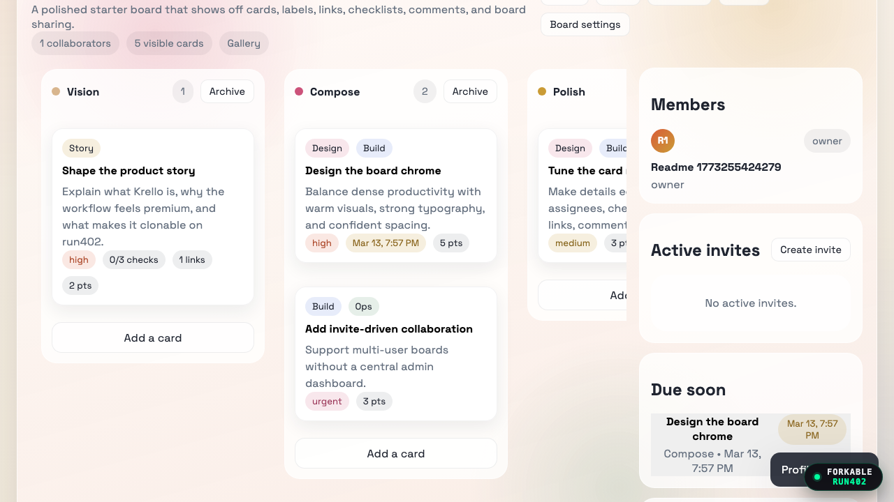

# Krello

A Trello-style collaboration app built on [Run402](https://run402.com).

[](https://github.com/kychee-com/krello/actions/workflows/format.yml)
[](https://github.com/kychee-com/krello/actions/workflows/codeql.yml)
[](https://github.com/kychee-com/krello/actions/workflows/lighthouse.yml)

<a href="https://krello.run402.com"></a>

**Try it live:** [krello.run402.com](https://krello.run402.com)

## Fork it

> [!TIP]
> Paste this into your coding agent (Claude Code, Cursor, etc.):
> ```
> Fork krello.run402.com using run402.com/llms.txt (curl it)
> ```

## Features

- Multi-user boards with invite links and roles (owner, admin, member, viewer)
- Drag-and-drop lists and cards
- Rich cards: labels, assignees, checklists, comments, due dates, priorities, estimates, link attachments
- Board templates (blank, sprint, roadmap, studio)
- Board duplication and JSON export
- Email/password auth via Run402
- Responsive, no-build static SPA

## Project structure

```
schema.sql     Postgres schema with RLS policies
function.js    Run402 function (board lifecycle, invites, roles)
deploy.ts      Deployment script for Run402
site/
  index.html   SPA entrypoint
  app.js       Application logic
  styles.css   Styles
  favicon.svg  App icon
```

## License

MIT
